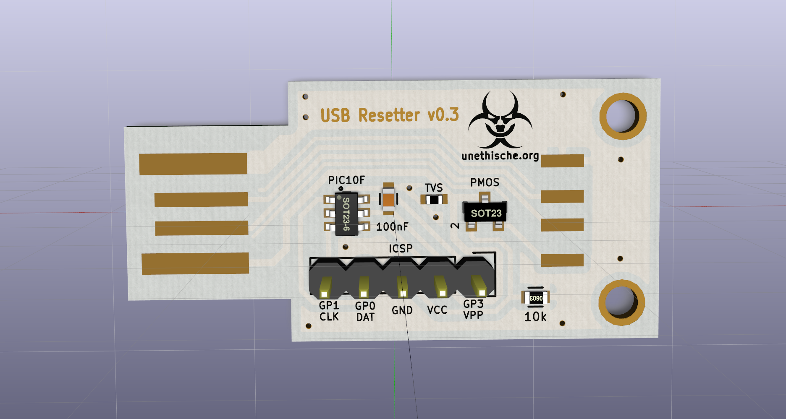

USBPicResetter
=================

This is a small board and firmware for resetting USB power periodically.
It utilizes a
[Microchip](http://www.microchip.com/)
[PIC10F200/202/204/206](http://ww1.microchip.com/downloads/en/DeviceDoc/41239D.pdf)
micro controller. The board design was done in
[KiCad](http://www.kicad-pcb.org/). You can
[order it at OSH Park](https://oshpark.com/shared_projects/06gSpBy6) in its
earlier version without the improved silkscreen (three for $5 + comonent
costs). The firmware can be compiled with the XC8 compiler via the
[MPLAB IDE](http://www.microchip.com/pagehandler/en-us/family/mplabx/).
Both tools should be free as in free beer. The layout was intended to be home
etched (single sided). The PIC10F200 can be had on Aliexpress for under 20
cents.
